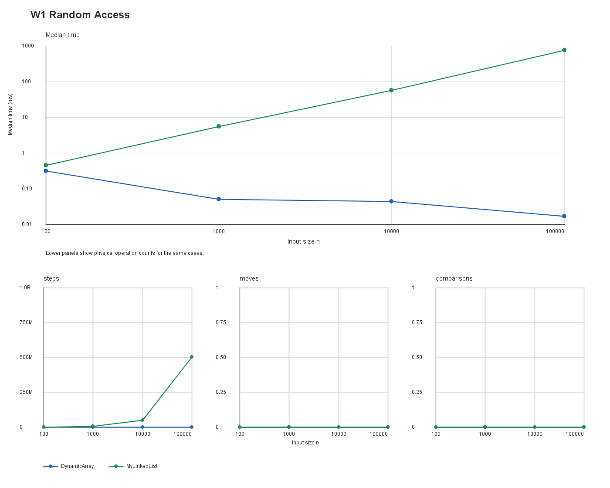
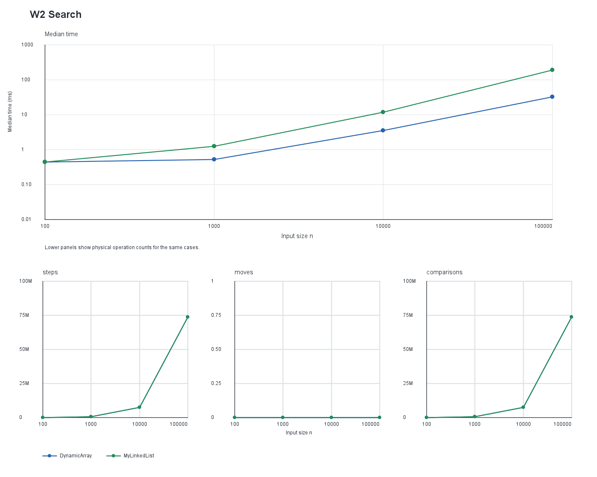
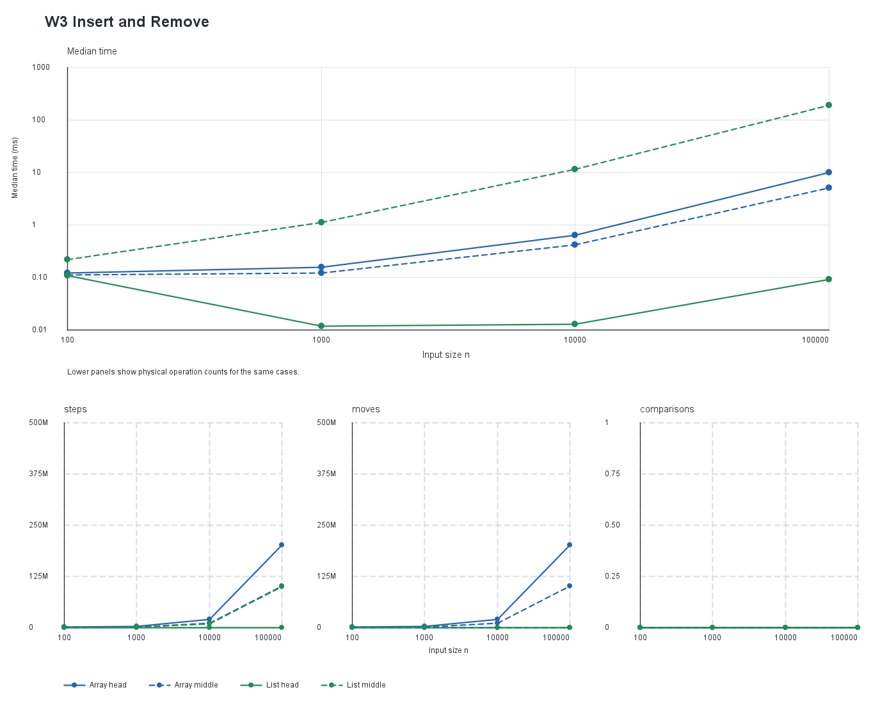
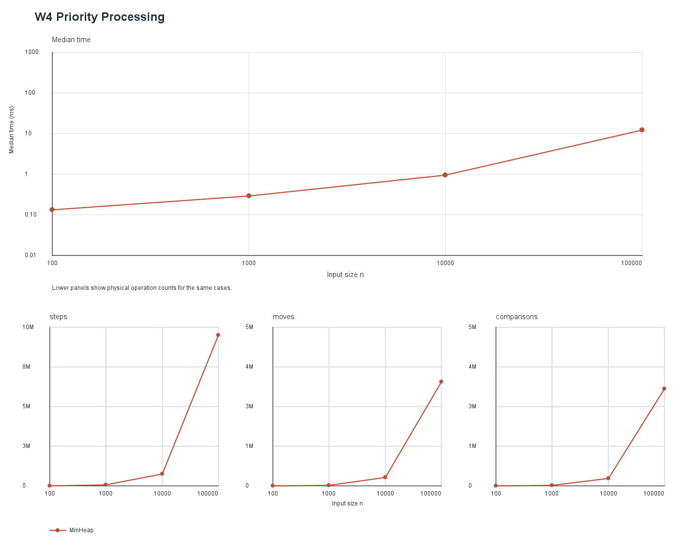

# Data Structures and Workload Analysis

## Implementation and measurement

`DynamicArray` stores values in an `int[]`, doubles its capacity when full, and shifts a suffix for indexed insertion or removal. `MyLinkedList` is a singly linked list with head and tail references, so append and front insertion are constant time. `MinHeap` stores values in an array and restores heap order with bubble-up and bubble-down. The implementations share the `IntSequence` API where their operations correspond.

The benchmark uses sizes 100, 1,000, 10,000, and 100,000. For each size, the input values come from `new Random(42)` and are reused for all applicable structures. It performs 10,000 random reads for W1, 1,000 half-present/half-absent searches for W2, 1,000 insertions followed by 1,000 removals at the head or fixed middle index for W3, and n inserts followed by n sorted extractions for W4. Each case runs once as warm-up and five measured times; the CSV reports the median measured time. Counter values come from the last measured repetition; the workloads are deterministic, so the counts match across repetitions.

The counters record array-cell reads and list-link traversals as steps, shifted/copied values and pointer changes as moves, and stored-value comparisons as comparisons. Bounds checks and index arithmetic are not counted. For W1-W3, initial population happens before the timer and counters are reset before workload operations. W4 includes both heap construction by repeated insertion and all extractions. Timings were collected on IntelliJ JBR 25.0.4; compilation targets Java 21.

## Complexity

Average cases for indexed operations assume a uniformly chosen valid index. Average search assumes a target position distributed across the sequence, with unsuccessful searches scanning the full sequence. Heap average cases assume a typical insertion order; worst cases are based on the height of the heap. Auxiliary space excludes values already held by the structure.

| Structure | Operation | Best | Average | Worst | Auxiliary space | Reason |
|---|---|---:|---:|---:|---:|---|
| DynamicArray | `add(x)` | Θ(1) | Θ(1) amortized | Θ(n) | O(n) on resize | Append is constant unless a full array is copied during doubling. |
| DynamicArray | `add(i,x)` | Θ(1) | Θ(n) | Θ(n) | O(n) on resize; otherwise O(1) | At the end no suffix shifts; a middle insertion shifts a linear suffix. |
| DynamicArray | `remove(i)` | Θ(1) | Θ(n) | Θ(n) | O(1) | Removing the last value shifts nothing; earlier positions shift the suffix. |
| DynamicArray | `get(i)` | Θ(1) | Θ(1) | Θ(1) | O(1) | Indexing reads one array cell. |
| DynamicArray | `contains(x)` | Θ(1) | Θ(n) | Θ(n) | O(1) | It stops at the first match or after scanning all values. |
| MyLinkedList | `add(x)` | Θ(1) | Θ(1) | Θ(1) | O(1) | The tail reference supports constant-time append. |
| MyLinkedList | `add(i,x)` | Θ(1) | Θ(n) | Θ(n) | O(1) | Head and tail insertion are constant; an interior insertion traverses to its predecessor. |
| MyLinkedList | `remove(i)` | Θ(1) | Θ(n) | Θ(n) | O(1) | Head removal is constant; other positions require traversal to the predecessor. |
| MyLinkedList | `get(i)` | Θ(1) | Θ(n) | Θ(n) | O(1) | The list follows one link per position from the head. |
| MyLinkedList | `contains(x)` | Θ(1) | Θ(n) | Θ(n) | O(1) | It compares each visited node until a match or the end. |
| MinHeap | `insert(x)` | Θ(1) | Θ(log n) | Θ(log n) | O(n) on resize; otherwise O(1) | Bubble-up may stop immediately or follow the heap height; doubling copies the backing array. |
| MinHeap | `peekMin()` | Θ(1) | Θ(1) | Θ(1) | O(1) | The minimum is stored at the root. |
| MinHeap | `extractMin()` | Θ(1) | Θ(log n) | Θ(log n) | O(1) | The replacement value may stop immediately or bubble down one root-to-leaf path. |

## Loop invariant proofs

### `DynamicArray.contains(x)`

**Invariant.** At the start of the iteration with index `i`, every array position from 0 through `i - 1` has been checked and none contains `x`.

**Initialization.** Before the first iteration, `i` is 0, so the prefix is empty and the statement holds.

**Maintenance.** If `elements[i]` equals `x`, the method returns `true`. Otherwise, incrementing `i` adds the just-checked position to the prefix, and it still contains no `x`.

**Termination.** If the loop ends with `i == size`, every valid position has been checked. The invariant therefore shows that `x` is absent, so returning `false` is correct.

**Conclusion.** The method returns `true` only after finding `x`, and returns `false` only after checking every stored value.

### `MinHeap.bubbleDown(parent)`

**Invariant.** Before each iteration, every parent-child relation in the active heap satisfies min-heap order except possibly a relation from the current `parent` to one of its children. The subtrees below the current node are heaps, and swapping has not changed the active values.

**Initialization.** Extraction replaces the root with the last active value. Before bubble-down, both child subtrees still satisfy heap order, all other relations are unchanged, and only the root may violate its child relations.

**Maintenance.** The loop selects the smaller child. If the parent is larger, swapping it with that child fixes the relation above the new current node. The displaced value can violate order only at its new position; the child subtrees remain heaps and the multiset is unchanged. Thus the invariant holds for the next iteration.

**Termination.** If there is no child, or the parent is no larger than the smaller child, then it is no larger than either child. With all other relations already valid, the whole active array is a min-heap.

**Conclusion.** Each swap moves the only possible violation down the tree, and termination leaves no violating parent-child relation.

## Workload plots

Time uses a logarithmic vertical scale. The lower panels show operation counts from the same CSV rows; `head` and `middle` are distinguished by line style for W3.

| W1 Random Access | W2 Search |
|---|---|
|  |  |

| W3 Insert and Remove | W4 Priority Processing |
|---|---|
|  |  |

## Discussion

At a fixed size, `DynamicArray.get(i)` reads one integer cell, while `MyLinkedList.get(i)` follows i links from the head. Array values are packed into adjacent memory, so a cache-line fetch often brings neighboring values and helps both random reads and sequential iteration. A list must follow a pointer from each node to the next, which limits prefetching and makes access depend on the previous load. Each list node also carries object and reference overhead that an integer array does not need. For n = 100,000, the 10,000 random reads measured 0.017 ms for the array and 754.936 ms for the list on the recorded JVM, illustrating the cost difference in this run. Both `contains` methods are linear, but the array scans compact integer storage while the list visits separate nodes. In W3 head operations, the list changes a few references per insertion or removal, whereas the array shifts the remaining values. At n = 100,000, the measured head case took 0.091 ms for the list and 10.097 ms for the array. At the middle index, the list performs many pointer traversals but only a few link updates, while the array shifts a large suffix; their counts and times show that equal step totals need not have equal costs. A list is a good choice when frequent operations are concentrated at the head and append is useful; this singly linked list still needs a traversal to remove the tail. A min-heap is better when the main requirement is repeatedly selecting and removing the smallest value, because insertion and extraction take logarithmic time while `peekMin` is constant. A heap is not a replacement for indexed access or searching arbitrary values. These wall-clock measurements depend on the JVM, processor, and system load, so operation counts and asymptotic behavior are more portable than the exact milliseconds.
